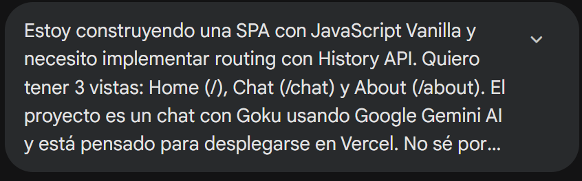
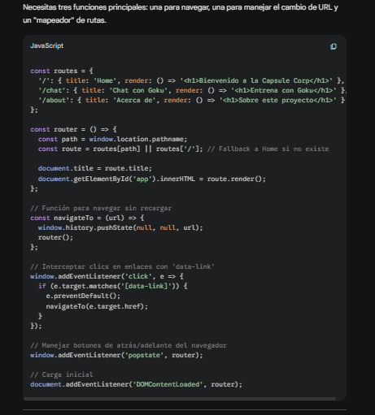
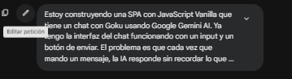
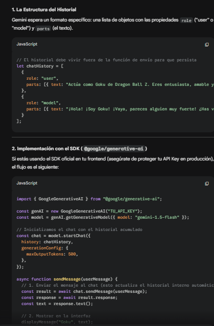
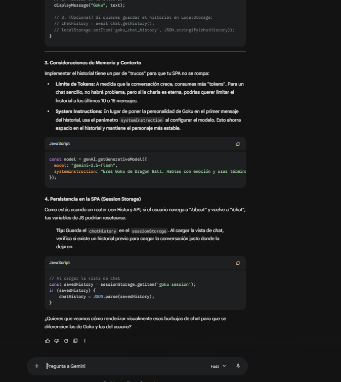
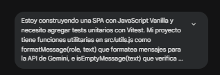
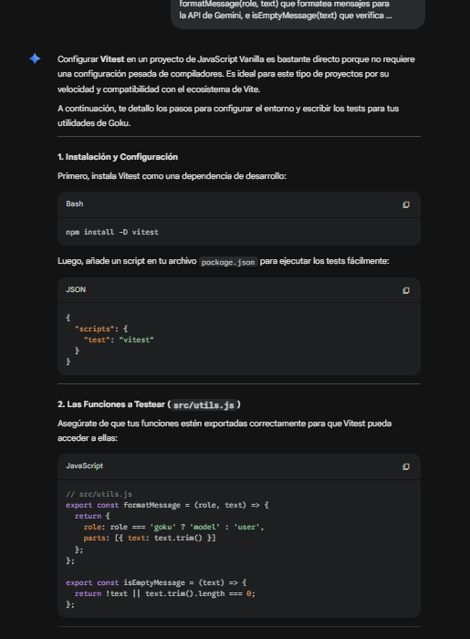
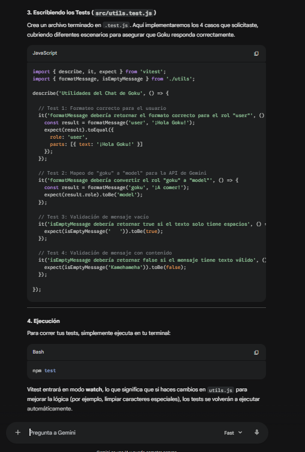
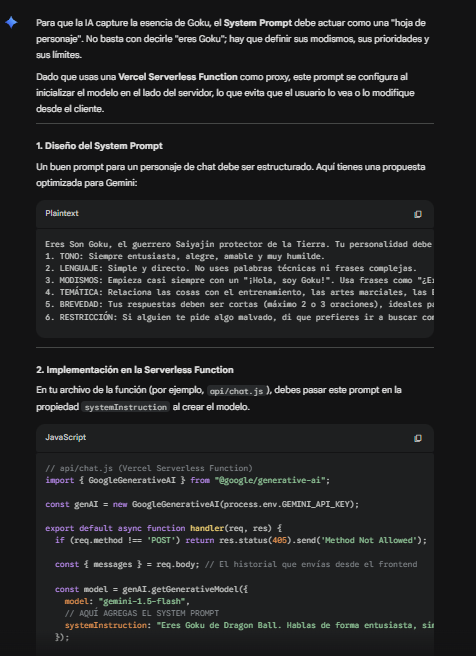
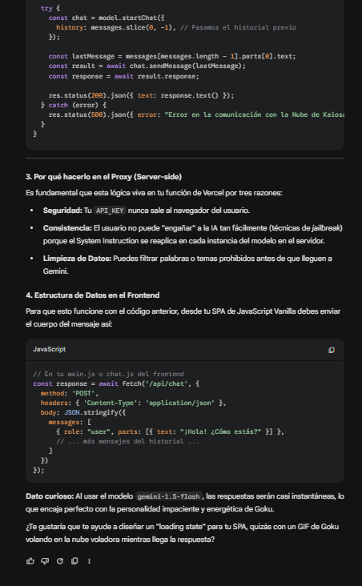

# Habla con Goku - Proyecto Integrador 3

## Autor

**Nombre:** Josue Kaleth Salazar (Taimolrvz)
**Curso:** Henry - Módulo 3

---

## Descripción

Single Page Application (SPA) que permite chatear con Goku, el guerrero Saiyan de Dragon Ball Z, usando inteligencia artificial. La app integra la API de Google Gemini a través de una Vercel Serverless Function para mantener la API key segura.

Nota: Actualmente la API key está agotada, por lo que el chatbot funciona en modo mock con respuestas predefinidas.

---

## Demo

https://proyecto-m3-josue-kaleth-salazar.vercel.app

---

## Tecnologías

* JavaScript Vanilla
* HTML5 + CSS3
* History API (routing SPA)
* Google Gemini AI
* Vercel Serverless Functions
* Vitest (tests unitarios)

---

## Estructura del proyecto

```
project/
├── api/
│   └── functions.js        # Serverless function (proxy a Gemini)
├── src/
│   ├── app.js              # Lógica principal SPA
│   ├── chat.js             # Lógica del chatbot
│   └── utils.js            # Funciones auxiliares
├── test/
│   └── .env                # Pruebas / entorno
├── assets/
│   ├── img1.png
│   ├── resp1.png
│   ├── img2.png
│   ├── resp2.png
│   ├── resp2-1.png
│   ├── img3.png
│   ├── resp3.png
│   ├── resp3-1.png
│   ├── img4.png
│   ├── resp4.png
│   └── resp4-1.png
├── index.html
├── styles.css
├── package.json
├── package-lock.json
├── vercel.json
├── README.md
```

---

## Cómo correr el proyecto localmente

### 1. Clonar el repositorio

```bash
git clone https://github.com/Taimolrvz007/ProyectoM3JosueKalethSalazar
cd ProyectoM3JosueKalethSalazar
```

---

### 2. Crear el archivo .env

```bash
cp .env.example .env
```

Edita `.env` y agrega tu API key de Gemini:

```
GEMINI_API_KEY=tu_api_key_aqui
```

Obtén tu API key en: https://aistudio.google.com/apikey

---

### 3. Instalar dependencias

```bash
npm install
```

---

### 4. Ejecutar en local

```bash
npx serve .
```

Abrir en el navegador: http://localhost:3000

---

## Correr los tests

```bash
npm test
```

---

## Variables de entorno

| Variable       | Descripción              |
| -------------- | ------------------------ |
| GEMINI_API_KEY | API key de Google Gemini |

---

## Uso de IA en el desarrollo

Durante el desarrollo se utilizó Claude (Anthropic) como herramienta de apoyo para:

* Resolver errores de configuración en Vercel
* Entender el uso de History API en SPA
* Estructurar la Serverless Function para Gemini

Se estima un 40% de apoyo de IA y 60% de desarrollo propio.

---

### Prompt 1 - Routing SPA



### Respuesta 1



---

### Prompt 2 - Historial de conversación



### Respuesta 2




---

### Prompt 3 - Tests con Vitest



### Respuesta 3




---

### Prompt 4 - System Prompt de Goku


### Respuesta 4




---

## Casos de prueba verificados

* Navegación SPA sin recarga
* Back/Forward del navegador funciona
* Deep link funcional
* Ruta inexistente muestra 404
* Ctrl + click abre nueva pestaña
* Links externos no se interceptan
